# Project – Operation: Suspicious File Transfer Investigation

---

## Overview

This project simulates a full **data exfiltration incident investigation** on a Linux system using **Splunk Free** as the SIEM. Acting as a junior SOC analyst, I configured kernel-level file monitoring with **auditd**, set up log forwarding with **rsyslog**, simulated a malicious insider staging and transferring sensitive files via SCP, and investigated the activity end-to-end using SPL queries — culminating in a formal incident report.

The scenario mirrors a real Tier 1 SOC workflow: an after-hours SCP alert fires, and you have to determine whether an unauthorized file transfer occurred, who did it, what was taken, and when.

---

## Environment

| Tool | Purpose |
|------|---------|
| Kali Linux (VirtualBox VM) | Lab environment |
| Splunk Enterprise Free | SIEM — log ingestion, search, alerting, dashboards |
| auditd / auditctl | Kernel-level file and process monitoring |
| rsyslog | Log forwarding pipeline to Splunk |
| SSH / SCP | Simulated file transfer vector |
| bash | User simulation, file staging, privilege escalation attempts |

---

## Lab Phases

| Phase | Area | What Was Done |
|-------|------|---------------|
| 1 | Sys Admin | Set up Linux environment, created `transferuser` account |
| 2 | Sys Admin + SOC | Installed and configured Splunk Free; added log data inputs |
| 3 | Sys Admin | Configured auditd rules for file, SCP, and SFTP monitoring |
| 4 | Sys Admin | Configured rsyslog to forward logs to Splunk over TCP 5514 |
| 5 | Blue Team / SOC | Simulated insider threat: file staging, SCP transfer, failed sudo escalation |
| 6 | SOC Analyst | Investigated with SPL queries; built incident timeline |
| 7 | SOC Analyst | Built Splunk dashboard with 3 investigation panels |
| 8 | SOC Analyst | Wrote formal incident report |

---

## Phase 2 — Splunk Setup & Data Inputs

Splunk was installed on the local machine and configured with three data inputs to ingest authentication, system, and audit logs.

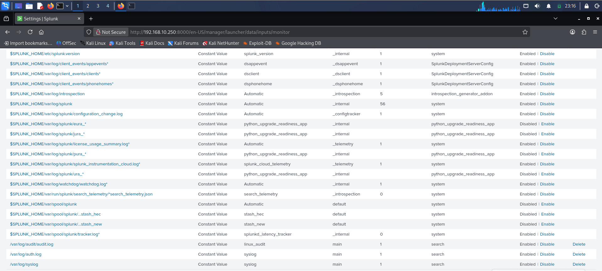
*Splunk Data Inputs page confirming all three log sources — auth.log, syslog, and audit.log — are active and flowing into the main index*

---

## Phase 3 — Auditd Configuration

Audit rules were written to a persistent rules file and loaded using `augenrules`. The rules track file access in `/home` and `/tmp`, as well as execution of `scp` and `sftp-server`.

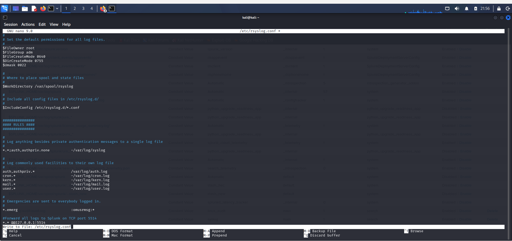
*Saving the audit rules file `/etc/audit/rules.d/file_transfer.rules` using nano — rules persist across reboots*

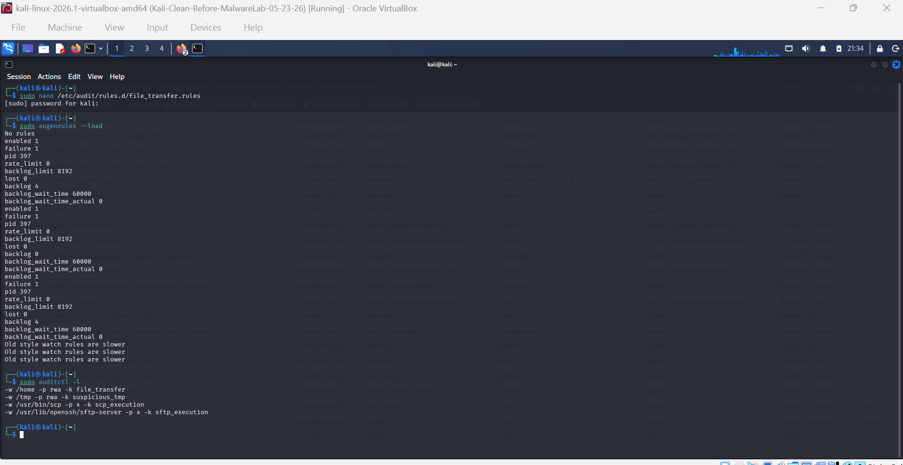
*Running `sudo augenrules --load` to reload rules from file, then `sudo auditctl -l` to verify all four rules are active — file_transfer, suspicious_tmp, scp_execution, and sftp_execution*

---

## Phase 4 — rsyslog Forwarding

rsyslog was configured to forward all system logs to Splunk over TCP port 5514. The TCP input was created inside Splunk to receive them.

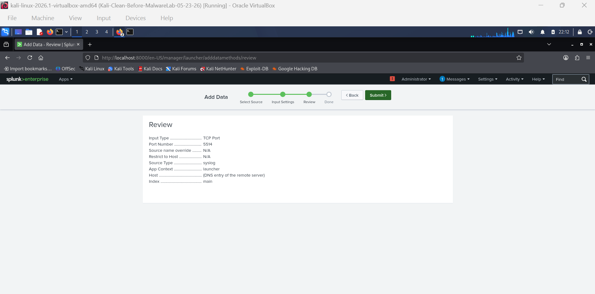
*Splunk Add Data review screen confirming TCP input settings — Port 5514, Source Type: syslog, Index: main — before submitting*

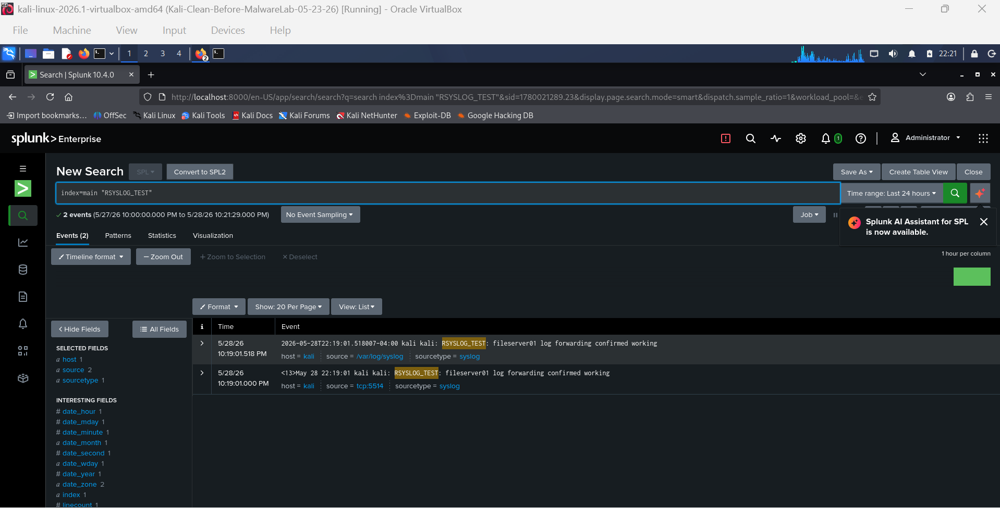
*Splunk search `index=main "RSYSLOG_TEST"` returning the test message generated by the `logger` command — confirms end-to-end log forwarding is working*

---

## Phase 5 — Simulating the Suspicious Activity

Logged in as `transferuser` to simulate a malicious insider. Sensitive files were created, staged in `/tmp`, transferred via SCP to a local drop directory, and failed privilege escalation attempts were made to generate authentication log entries.

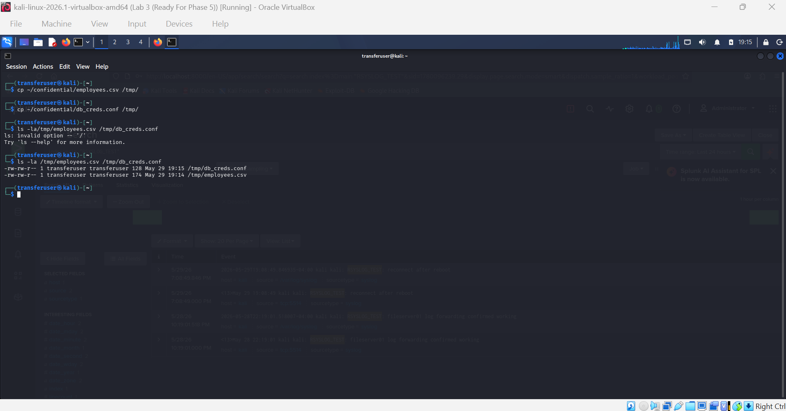
*Copying `employees.csv` and `db_creds.conf` from `~/confidential/` to `/tmp/` — simulates the pre-exfiltration staging step*

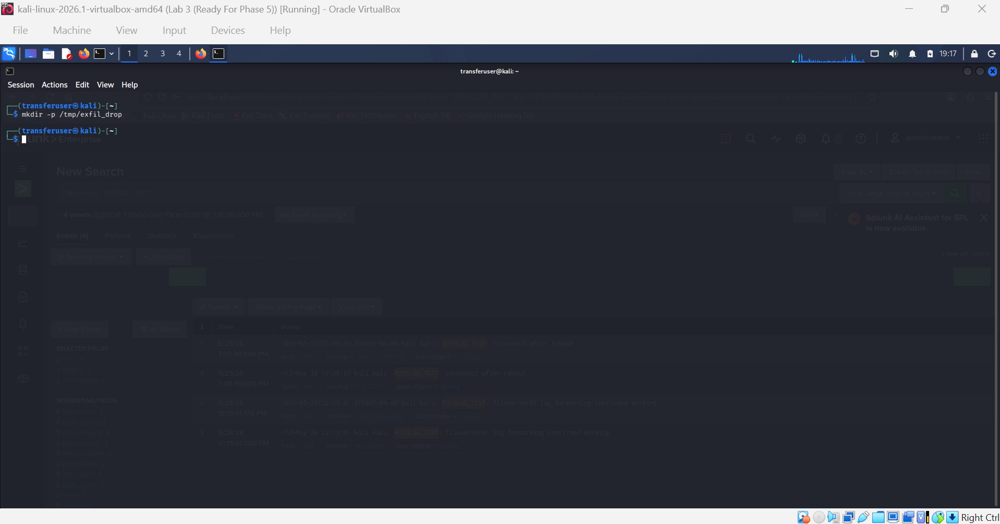
*Creating `/tmp/exfil_drop` as the destination for the SCP transfer — simulates the attacker's receiving directory*

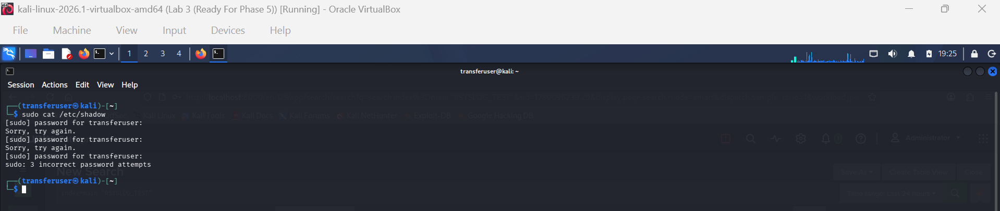
*`transferuser` attempting `sudo cat /etc/shadow` and failing authentication 3 times — generates critical entries in auth.log and audit.log*

---

## Phase 6 — SPL Investigation in Splunk

### SCP Execution Confirmed via auditd

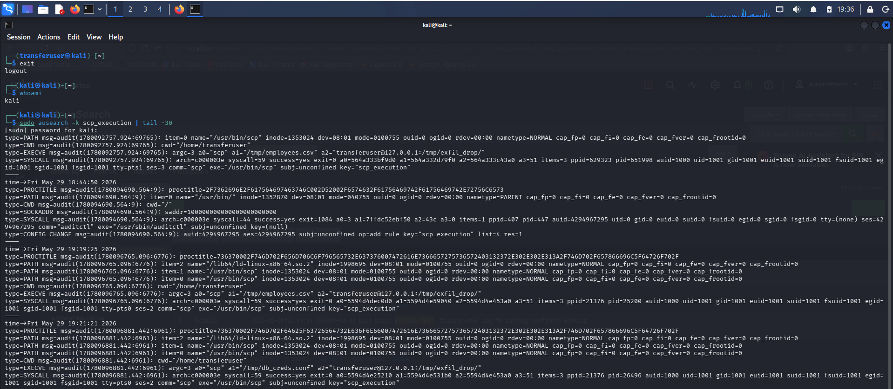
*`sudo ausearch -k scp_execution | tail -30` output showing detailed auditd entries for the SCP commands executed by `transferuser` — includes exe path, UID, arguments, and destination*

### /tmp Staging Confirmed

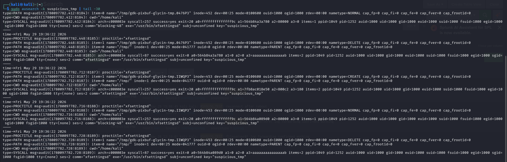
*`sudo ausearch -k suspicious_tmp | tail -30` showing auditd SYSCALL entries triggered by `transferuser` (UID 1001) accessing files in `/tmp` — confirms the staging step was logged*

### UID Cross-Reference

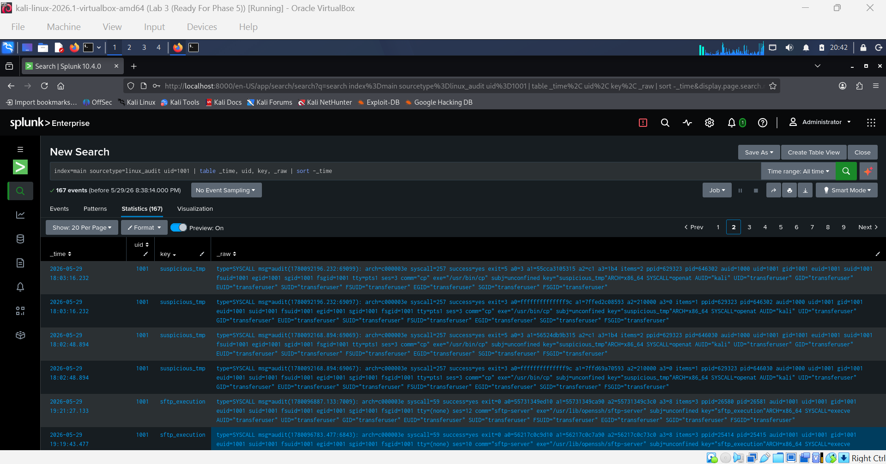
*Splunk query `index=main sourcetype=linux_audit uid=1001` — cross-referencing UID 1001 against audit events to confirm all suspicious activity traces back to `transferuser`*

### /home Directory File Access

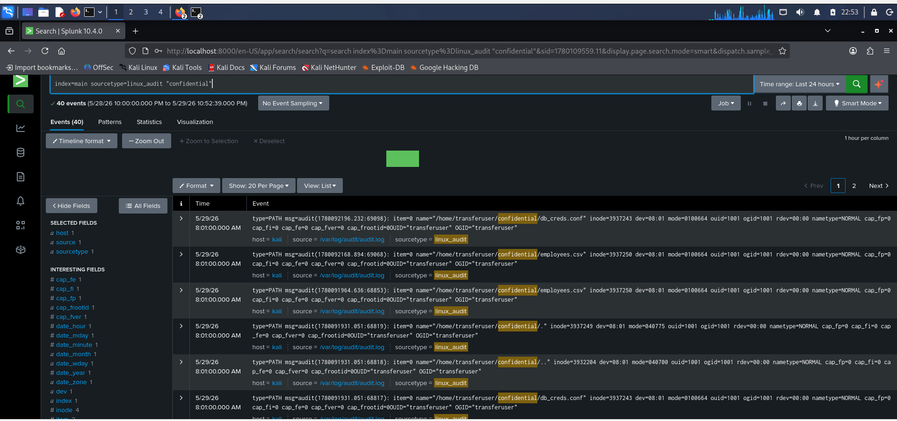
*Splunk query detecting access events in `/home/transferuser/confidential/` — confirms `employees.csv` and `db_creds.conf` were read before being staged*

### SPL Query — Auth Events Over Time

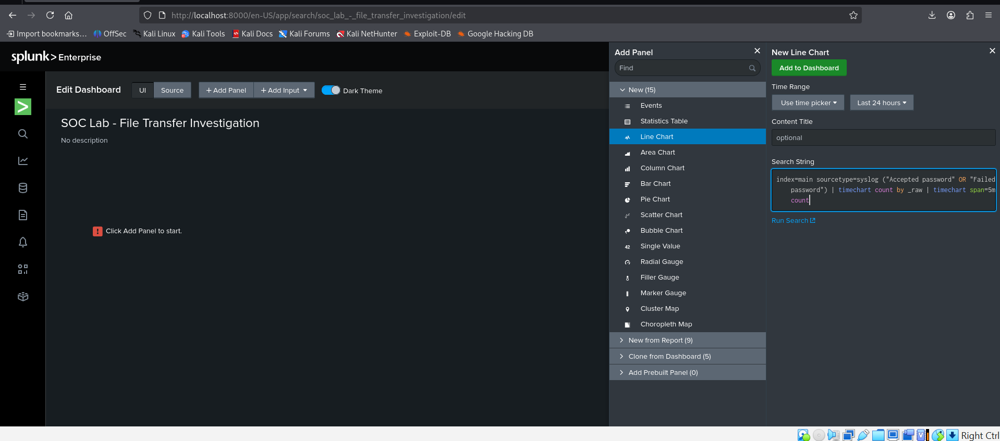
*Dashboard panel query for authentication events over time — timechart of accepted and failed password events used for the investigation timeline*

### SPL Query — SCP Executions

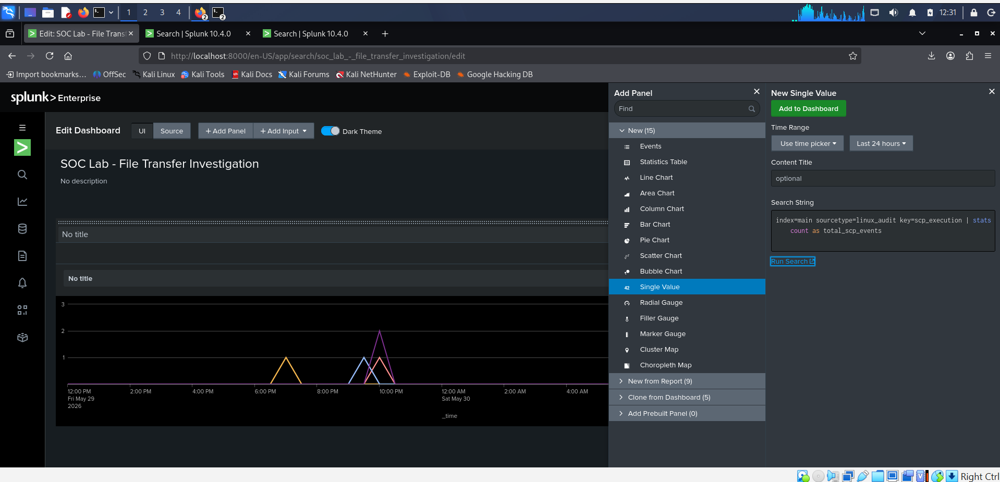
*`index=main sourcetype=linux_audit key=scp_execution | stats count as total_scp_events` — single value panel query returning total SCP execution count*

### SPL Query — Top Users by Activity

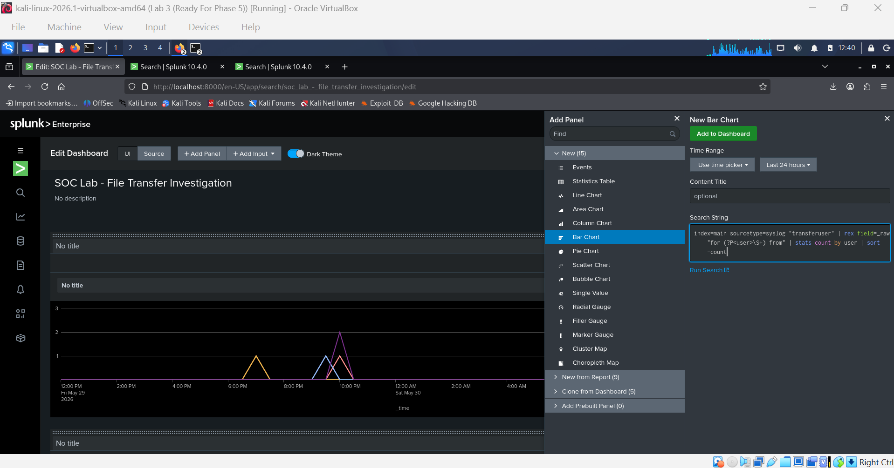
*Bar chart panel query extracting user field from syslog events and ranking by event count — `transferuser` dominates the activity*

---

## Phase 6 — Alert Configuration

A scheduled Splunk alert was created to automatically flag future SCP executions, running every 5 minutes against the `scp_execution` audit key.

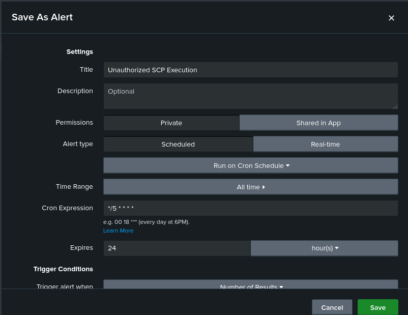
*"Unauthorized SCP Execution" alert configured as a scheduled alert with a cron expression of `*/5 * * * *` — triggers when results exceed 0*

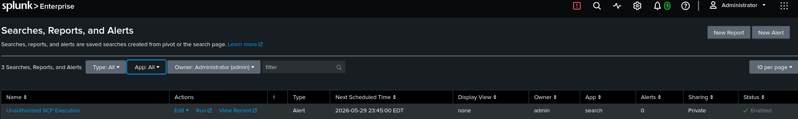
*Splunk Searches, Reports, and Alerts page showing the "Unauthorized SCP Execution" alert listed as Enabled — next scheduled run visible*

---

## Phase 7 — Splunk Dashboard

A custom dashboard titled **SOC Lab - File Transfer Investigation** was built with three panels: auth events over time (line chart), total SCP execution count (single value), and top users by activity (bar chart).

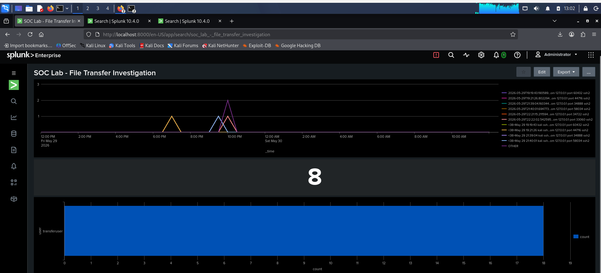
*Completed Splunk dashboard showing all three investigation panels — auth events timeline, SCP count of 8, and transferuser bar chart*

---

## Incident Summary

| Field | Finding |
|-------|---------|
| Incident ID | INC-2026-001 |
| Affected Host | fileserver01 / 127.0.0.1 |
| Affected Account | `transferuser` (UID: 1001) |
| Incident Type | Unauthorized File Transfer / Suspected Data Exfiltration |
| Detection Source | auditd `scp_execution` key — ingested via Splunk |
| Files Accessed | `/home/transferuser/confidential/employees.csv`, `db_creds.conf` |
| Files Staged | `/tmp/employees.csv`, `/tmp/db_creds.conf` |
| Transfer Method | SCP over SSH to `127.0.0.1:/tmp/exfil_drop/` |
| Privilege Esc. Attempts | 3 failed sudo attempts detected in auth.log |
| Root Cause | Insider threat — after-hours file transfer with no change ticket |

---

## Skills Demonstrated

| Skill | How It Was Applied |
|-------|--------------------|
| SIEM Configuration | Installed Splunk Free; configured file, syslog, and audit log data inputs |
| auditd / Linux Hardening | Wrote and persisted audit rules for file access, SCP, and SFTP monitoring |
| rsyslog Log Forwarding | Configured TCP forwarding pipeline from Linux to Splunk |
| SPL (Splunk Query Language) | Wrote queries to detect auth failures, SCP execution, file staging, and UID attribution |
| Incident Timeline Construction | Correlated events across syslog and linux_audit sourcetypes chronologically |
| Alerting | Built scheduled Splunk alert for ongoing SCP execution detection |
| Dashboard Building | Created 3-panel SOC investigation dashboard |
| Incident Reporting | Produced formal incident report with findings, timeline, and recommendations |
| Threat Simulation | Simulated insider threat: file creation, staging, SCP transfer, privilege escalation |

---

## Lessons Learned

**auditd is extremely granular — and extremely noisy.** The `key` tagging system (`-k scp_execution`, `-k suspicious_tmp`) is essential for making audit logs searchable in a SIEM. Without it, finding relevant events in a high-volume audit log would be impractical.

**Log forwarding is a foundational sysadmin skill.** Configuring rsyslog to push to Splunk over TCP mirrors what every production environment does with a central SIEM. Understanding the pipeline — from kernel event → auditd → rsyslog → Splunk → alert — gives you the mental model to troubleshoot any piece of it when it breaks.

**UID is more reliable than username in audit logs.** Audit events record numeric UIDs, not display names. Cross-referencing UID 1001 to `transferuser` is a step that trips up new analysts. Always run `id <username>` early and note the UID for your SPL queries.

**Staging in /tmp is a real attacker behavior.** `/tmp` is world-writable, often excluded from backup monitoring, and historically overlooked. Watching it with auditd is a lightweight but effective detection control.

---

## References

- [Splunk Enterprise Free Download](https://www.splunk.com/en_us/download/splunk-enterprise.html)
- [Splunk SPL Quick Reference](https://docs.splunk.com/Documentation/Splunk/latest/SearchReference)
- [auditd Documentation](https://linux.die.net/man/8/auditd)
- [rsyslog Documentation](https://www.rsyslog.com/doc/)
- [TryHackMe SOC Level 1 Path](https://tryhackme.com/path/outline/soclevel1)
- [Splunk Fundamentals 1 (Free Cert)](https://education.splunk.com)
